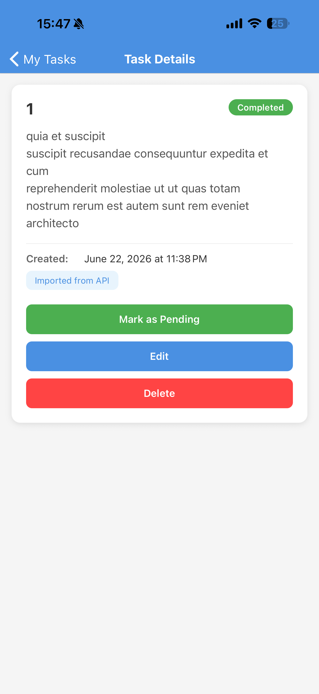
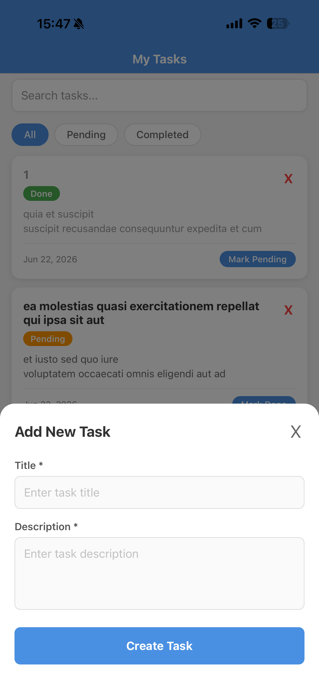
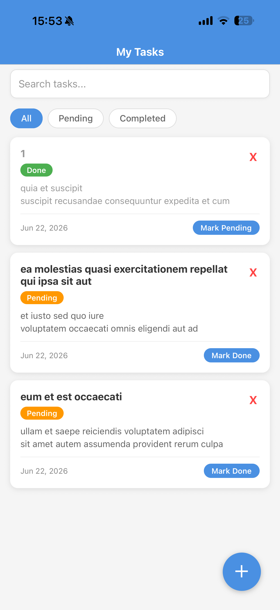

# Pritech Task App

## Short explanation of what was implemented
- Centralized task logic into a custom hook: `src/hooks/useTasks.js` (loading, persistence, filtering, search, and mutators).
- Refactored `TaskListScreen` and `TaskDetailScreen` to use the hook and use navigation callbacks for updates/removals.
- Search is limited to task titles only; tasks persist via AsyncStorage.

## Prerequisites
- Node.js (use nvm to manage versions)
- npm (bundled with Node) or yarn
- Expo CLI (optional; project includes npm scripts that use the local `expo` dependency)

## Install
From the project root, install and start the app:

```bash
npm i
npm start
```

Note: a `.npmrc` is included to simplify installs for contributors.

## Run
- Start the Expo dev server:

```bash
npm start
# or
expo start
```

- Run on Android emulator/device:

```bash
npm run android
```

- Run on iOS simulator/device (macOS):

```bash
npm run ios
```

## Project structure highlights
- `src/screens` — main screens (`TaskListScreen`, `TaskDetailScreen`)
- `src/components` — UI components (`TaskCard`, `TaskInput`, `SearchBar`, `FilterButtons`)
- `src/hooks/useTasks.js` — centralized task hook (loading, persistence, search/filter, mutators)
- `src/utils/storage.js` — local storage helpers

## Screenshots
Below are screenshots of the app (rendered by GitHub when viewing this repository):








